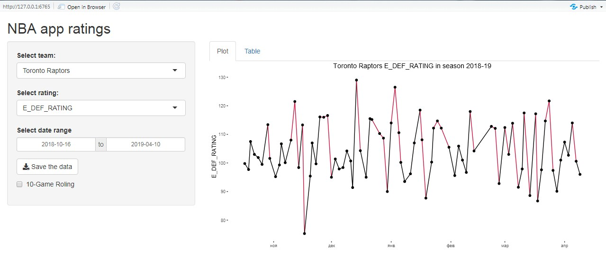
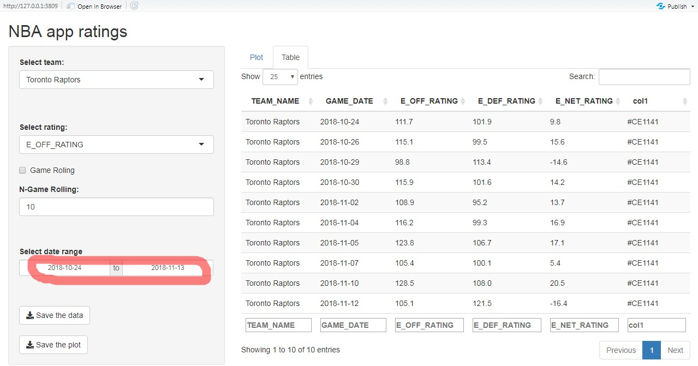
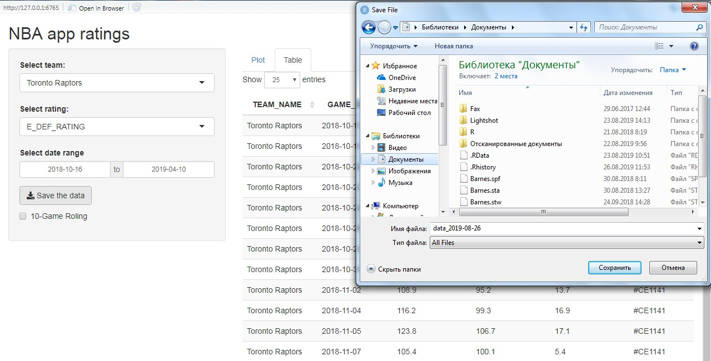
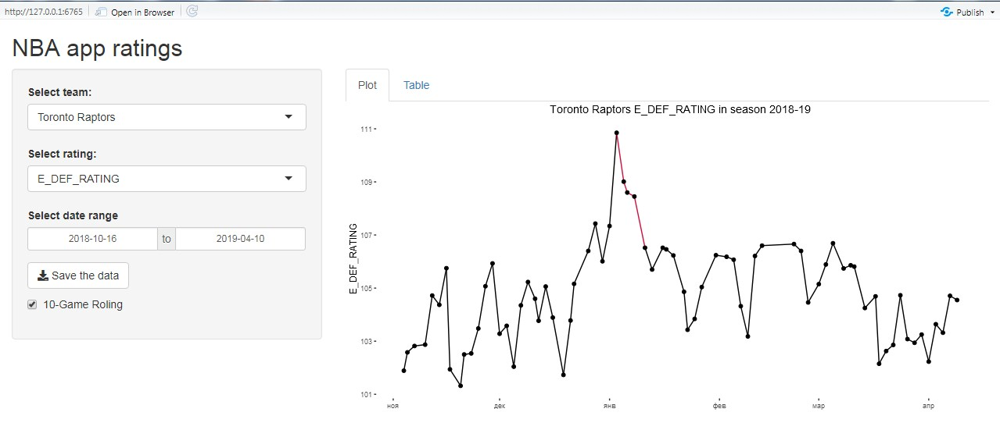

## Приложение RShiny "Рейтинги команд НБА в сезоне 2018-19" (в работе)

### ```rshiny``` - пакет позволяющий создавать веб-приложения.

Приложение **NBA app rating** может:

* Выбирать команды для отображения в таблице и графике ~~(пока там только одна команда)~~ добавлены все 30 команд
* Выбирать какой из рейтингов команды и в каком диапазоне дат нужно построить. Имеются три варианта:
  * E_OFF_RATING (estimate атакующий рейтинг)
  * E_DEF_RATING (estimate защитный рейтинг)
  * E_NET_RATING (estimate нет рейтинг)


 
* Выбирать диапазон дат отображения данных в таблице



* Сохранять данные выбранной команды



* Использовать 10-матчевое скользящее среднее для сглаживание дисперсии



Планы по улучшению приложения:

* Сделать график более привлекательным визуально
  * Добален заголовок графика
  * Добавлен цвет линий для E_OFF_RATING и E_DEF_RATING (если выше среднего по Лиге - главный цвет команды, если ниже - чёрный). Цвета взяты с сайта [teamcolorcodes](https://teamcolorcodes.com/)
  * Удалена подпись оси X.
* ~~Добавить возможность выбирать диапазон дат для отображения на графике~~ (сделано)
* ~~Добавить возможность построение графика и таблицы по скользящему среднему.~~ (сделано)
* Добавить возможность выбора шага для скользящего среднего (пока только 10-матчевое)
