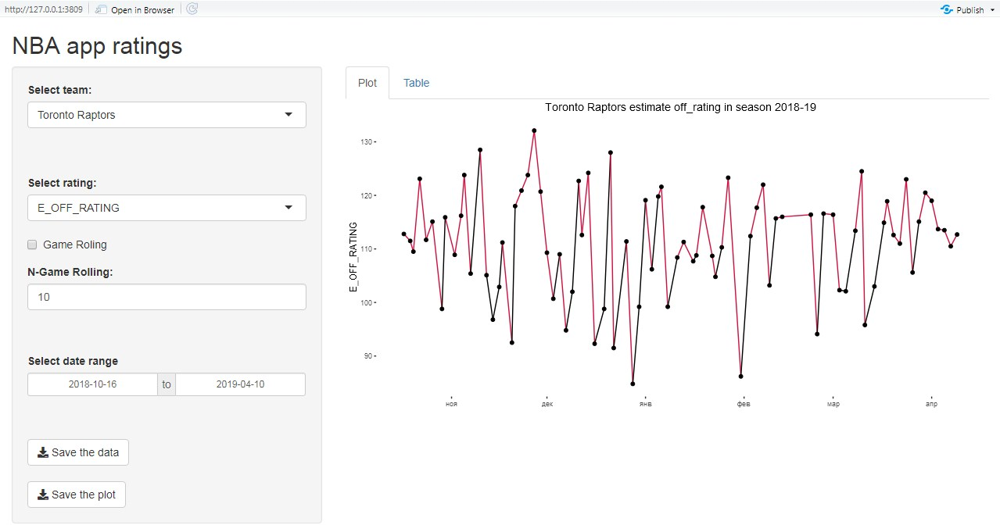
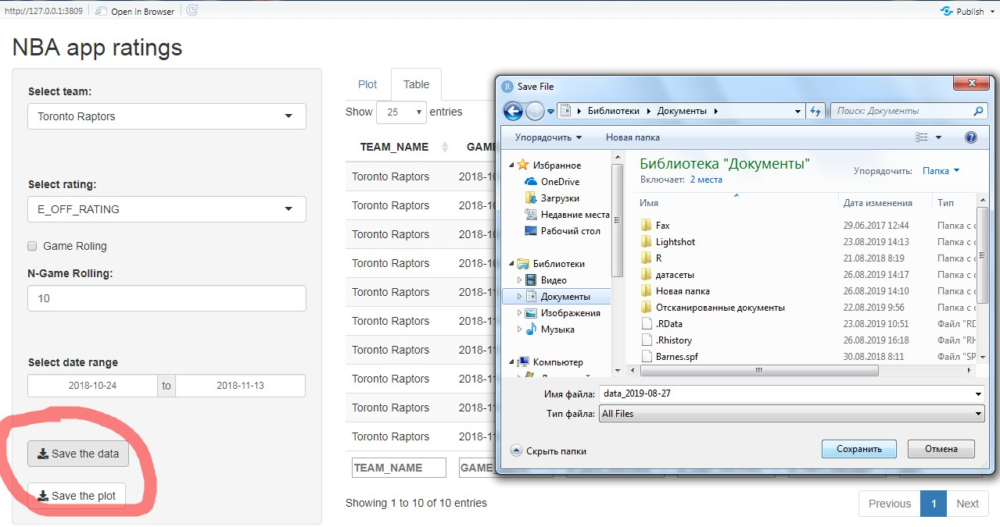
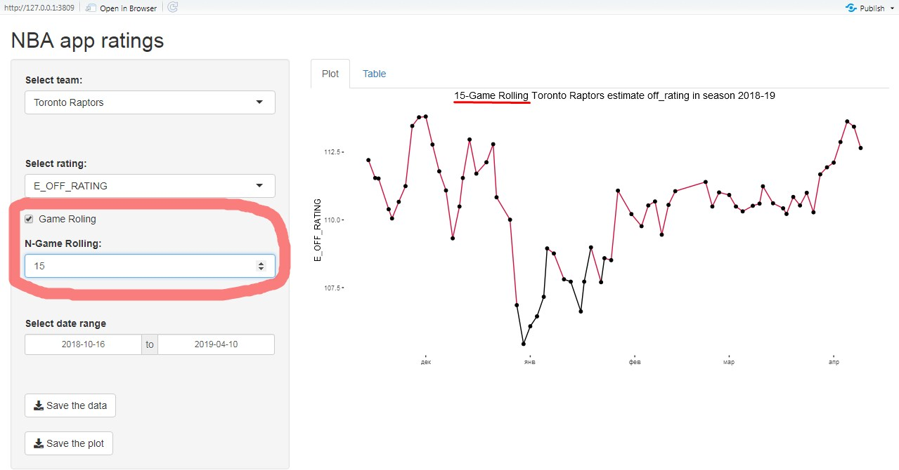
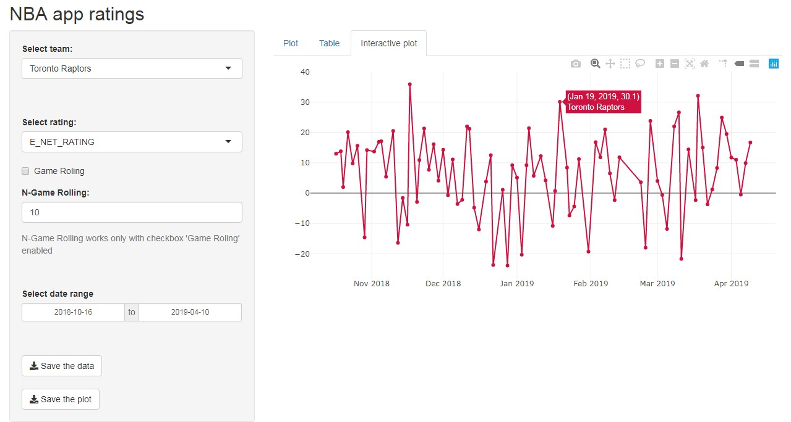

## Приложение RShiny "Рейтинги команд НБА в сезоне 2018-19" (в работе)

### ```rshiny``` - пакет позволяющий создавать веб-приложения.

Приложение **NBA app rating** может:

* Выбирать команды для отображения в таблице и графике ~~(пока там только одна команда)~~ добавлены все 30 команд
* Выбирать какой из рейтингов команды и в каком диапазоне дат нужно построить. Имеются три варианта:
  * E_OFF_RATING (estimate атакующий рейтинг)
  * E_DEF_RATING (estimate защитный рейтинг)
  * E_NET_RATING (estimate нет рейтинг)


 
* Выбирать диапазон дат отображения данных в таблице


* Сохранять табличные данные выбранной команды



* Сохранять выбранный график

* Использовать N-матчевое скользящее среднее для сглаживание дисперсии (число N указывается пользователем)



* Отображать интерактивные графики, построенные с помощью пакета ```plotly```



Планы по улучшению приложения:

* Сделать график более привлекательным визуально
  * Добален заголовок графика
  * Добавлен цвет линий для E_OFF_RATING и E_DEF_RATING (если выше среднего по Лиге - главный цвет команды, если ниже - чёрный). Цвета взяты с сайта [teamcolorcodes](https://teamcolorcodes.com/)
  * Удалена подпись оси X.
  * В заголовке графика отображается используется ли скользящее среднее или нет. Конструкции E_ХХХ_RATING заменены на estimate xxx rating.
* ~~Добавить возможность выбирать диапазон дат для отображения на графике~~ (сделано)
* ~~Добавить возможность построение графика и таблицы по скользящему среднему.~~ (сделано)
* ~~Добавить возможность выбора шага для скользящего среднего (пока только 10-матчевое)~~ (сделано)
* ~~Заменить статичный график интерактивной версией.~~ (добавлена вкладка **Interactive plot**)

Адрес веб-приложения: [https://vladislavshufinskiy.shinyapps.io/nba_rating_2018_19/](https://vladislavshufinskiy.shinyapps.io/nba_rating_2018_19/)
